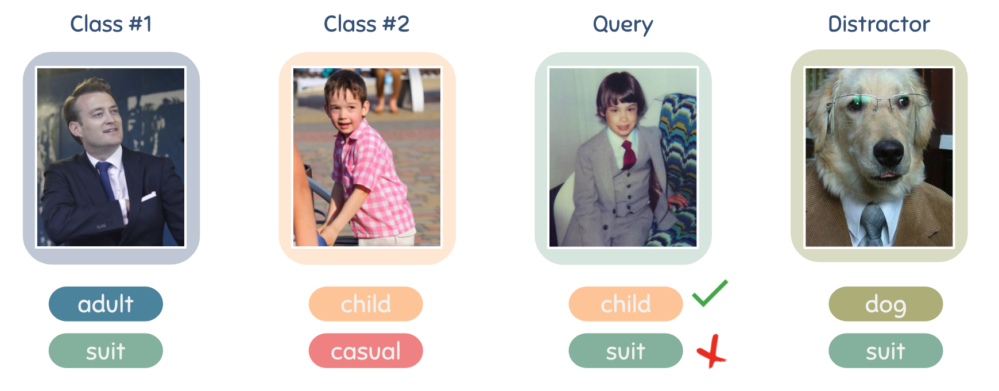

# Poodle

This repository contains the implementation of the paper [POODLE: Improving Few-shot Learning via Penalizing Out-of-Distribution Samples]().

[Duong H. Le\*](https://lehduong.github.io), [Khoi D. Nguyen\*](https://khoiucd.github.io), [Khoi Nguyen](https://nguyenducminhkhoi.com), [Quoc-Huy Tran](https://cs.adelaide.edu.au/~huy/home.php), [Rang Nguyen](https://sites.google.com/site/rangmanhonguyen/), [Binh-Son Hua](https://sonhua.github.io) (NeurIPS 2021)

**TLDR**: We leverage samples from distractor classes or randomly generated noise to improve the generalization of few-shot learner.



## Citation

If you find our paper/code helpful, please cite our paper:

```
@inproceedings{
le2021poodle,
title={{POODLE}: Improving Few-shot Learning via Penalizing Out-of-Distribution Samples},
author={Duong Hoang Le and Khoi Duc Nguyen and Khoi Nguyen and Quoc-Huy Tran and Rang Nguyen and Binh-Son Hua},
booktitle={Thirty-Fifth Conference on Neural Information Processing Systems},
year={2021},
url={https://openreview.net/forum?id=wEvO8BCqZcm}
}
```

## Introduction

In this work, we propose to use out-of-distribution samples, i.e., unlabeled samples coming from outside the target classes, to improve few-shot learning. Specifically, we exploit the easily available out-of-distribution samples to drive the classifier to avoid irrelevant features by maximizing the distance from prototypes to out-of-distribution samples while minimizing that of in-distribution samples (i.e., support, query data). Our approach is simple to implement, agnostic to feature extractors, lightweight without any additional cost for pre-training, and applicable to both inductive and transductive settings. Extensive experiments on various standard benchmarks demonstrate that the proposed method consistently improves the performance of pretrained networks with different architectures.

## Usage

### 1. Download datasets

1. Download these zipped files and put them into `./data`

   - [mini-Imagenet](https://drive.google.com/open?id=0B3Irx3uQNoBMQ1FlNXJsZUdYWEE)
   - [tiered-Imagenet](https://drive.google.com/file/d/1g1aIDy2Ar_MViF2gDXFYDBTR-HYecV07)
   - [CUB200](http://www.vision.caltech.edu/datasets/cub_200_2011/)

2. (Optional) Download pretrained checkpoints [here](https://drive.google.com/drive/folders/1A-Zni3TkprJ8uKe1IYBxC9GUsyRlSVLc?usp=sharing) and extract to `./results`.

3. Run `init.sh` to preprocess all data.

After these steps, the your folder should be organized as follow:

```
results/
├── cub/
    ├── resnet12/
    ├────── student_0/
    ├────── student_1/
    ├────── checkpoint.pth.tar
    ├────── model_best.pth.tar
    ├── resnet12_ssl/
├── mini/
    ├── resnet12/
    ├── resnet12_ssl/
    ├── ...
├── tiered/
    ├── resnet12/
    ├── resnet12_ssl/
    ├── ...
data/
├── images/
    ├── n0153282900000005.jpg
    ├── n0153282900000006.jpg
    ├── ...
├── tiered-imagenet/
    ├── data/
    ├── class_names.txt
    ├── ...
├── CUB_200_100/
    ├── attributes/
    ├── images/
    ├── ...
├── split/
    ├── mini/
    ├────── train.csv
    ├────── val.csv
    ├────── test.csv
    ├── tiered/
    ├────── train.csv
    ├────── val.csv
    ├────── test.csv
    ├── cub/
    ├────── train.csv
    ├────── val.csv
    ├────── test.csv
assets/
configs/
src/
...
```

### 2. How to run

To run the code:

1. Reconfigurate argument in `run.sh` (please read the comment to adjust the dataset/architecture). Quick guideline:
   - To train the model, remove the option `--evaluate`.
   - To train the model with rotation loss, add `--do-ssl`.
   - Note that, knowledge distillation is done after finishing training automatically.
   - Set `save_path` in `[resnet12 | mobilenet | wideres | ...].config` to different checkpoints for **simple**, **rot**, and **rot+kd** baselines for example:
     - **simple**: set `save_path` to `./results/mini/resnet12`.
     - **rot**: set `save_path` to `./results/mini/resnet12_ssl`.
     - **rot+kd**: set `save_path` to `./results/mini/resnet12_ssl/student_1`.

2. Run `bash run.sh`

## Acknowledgement

Our implementation is based on the the official implementation of [Simple Shot](https://github.com/mileyan/simple_shot) and [TIM](https://github.com/mboudiaf/TIM).
